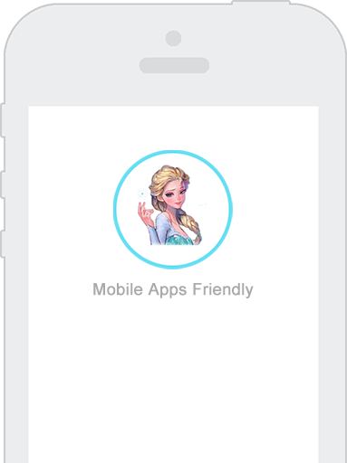
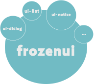
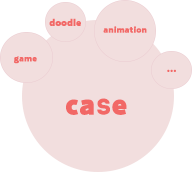
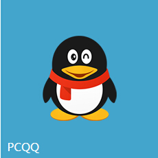

---

<link rel="stylesheet" type="text/css" href="/static/index.css">

	

		

			<h3>简单易用，轻量快捷， 为移动端服务的前端框架。</h3>
			<a href="docs/start.html">开始使用</a>
			<a href="https://github.com/frozenui/" target="_blank">Github地址</a>
		

		
	

	

		
		

			<h2>随心所用的样式组件</h2>
			
Frozen提供的CSS组件是目前QQ会员前端开发组所用的通用样式库。遵循手Q样式规范，基本样式使用离线包的方式减少请求，并提供快速接入的方案。

			<a href="/baseui">查 看</a>
		

	

	

		
		

			<h2>更显灵动的JS插件</h2>
			
Frozen提供的一系列JavaScript插件，更优雅地在移动端上呈现更灵动的动画效果。

			<a href="/frozenjs">查 看</a>
		

	

	

		
		

			<h2>酷炫好玩的案例秀</h2>
			
Frozen提供的Animation case，把业务上有趣好玩的案例沉淀下来，帮助日后能更快速找到设计灵感。

			<a href="/docs/case.html">查 看</a>
		

	

	<h2 class="fr-yewu-title">应用业务</h2>
	
目前，frozen已经应用到实际业务，并在不断完善中。

	<ul>
		<li class="fr-yewu1"></li>
		<li class="fr-yewu2"></li>
		<li class="fr-yewu3"></li>
		<li class="fr-yewu4"></li>
	</ul>

